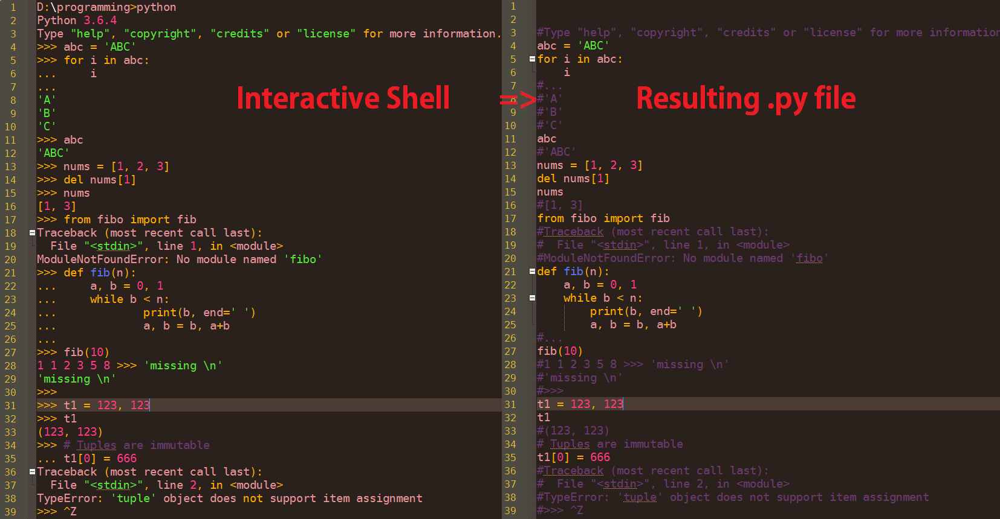

# save-interactive-python-session-to-file
creates mostly working .py from interactive python code

<h1><b>Instructions:</b></h1>

1. Place code into interactive_session.py

2. Run scipt in the same folder
3. output.py will be created
